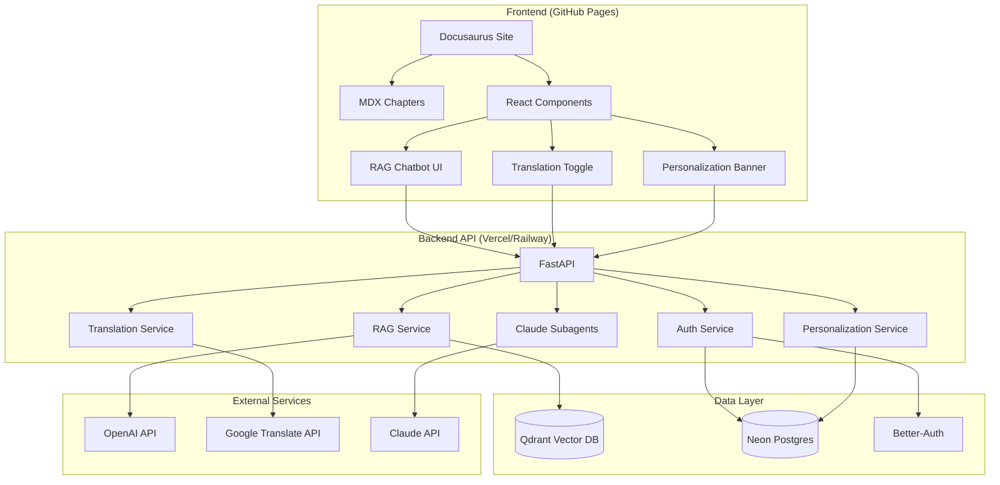
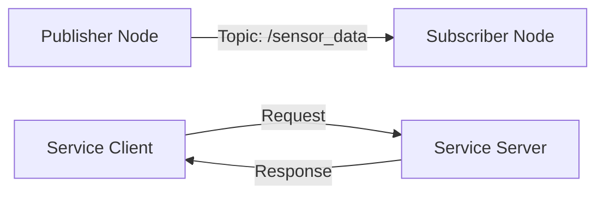

# Implementation Plan: Module 1 - The Robotic Nervous System (ROS 2)

**Branch**: `001-ros2-module` | **Date**: 2025-12-07 | **Spec**: [spec.md](./spec.md)
**Input**: Feature specification from `/specs/001-ros2-module/spec.md`

## Summary

This plan details the implementation of Module 1 (ROS 2 fundamentals) within the larger AI-Native Textbook + RAG Chatbot system. The module consists of 3 chapters delivered as MDX documents in Docusaurus, integrated with a FastAPI backend providing RAG chatbot assistance, authentication, personalization, and Urdu translation.

**Primary Requirement**: Create beginner-friendly, technically accurate ROS 2 learning content covering middleware concepts, nodes/topics/services communication patterns, and URDF robot modeling, with hands-on rclpy code examples.

**Technical Approach**: Iterative content development (structure → drafting → integration → review) using Docusaurus for frontend, FastAPI backend with Qdrant (vectors) + Neon Postgres (metadata), Better-Auth for user management, and Claude Subagents for intelligent features.

## Technical Context

**Frontend**:
- **Framework**: Docusaurus 3.x (TypeScript)
- **Language**: MDX (Markdown + JSX) for chapter content
- **Styling**: Custom CSS + React components for interactive elements
- **Target Platform**: Static site deployed to GitHub Pages

**Backend**:
- **Framework**: FastAPI (Python 3.11+)
- **Language**: Python 3.11+
- **Primary Dependencies**: FastAPI, OpenAI Agents/ChatKit, Qdrant (vector DB), Neon Postgres (metadata), Better-Auth SDK, Google Translate API
- **Storage**: Qdrant (embeddings), Neon Postgres (user profiles, metadata, onboarding responses)
- **Testing**: pytest (backend), Jest/Vitest (frontend components)
- **Target Platform**: Vercel or Railway (backend API)

**Project Type**: Web application (frontend static site + backend API)

**Performance Goals**:
- Page load time: <2 seconds for chapter pages
- RAG query response: <3 seconds for typical queries
- Embedding generation: Batch process during content deployment (not real-time)
- Support 100 concurrent users during hackathon demo

**Constraints**:
- All code examples MUST execute successfully on ROS 2 Humble (Ubuntu 22.04)
- MDX content MUST be beginner-friendly (no assumed ROS 2 knowledge)
- RAG accuracy: >80% relevant responses for Module 1 queries
- Deployment MUST be manual-executable within 30 minutes

**Scale/Scope**:
- Module 1: 3 chapters (~5000-7000 words total)
- Full textbook: 5 modules planned (Module 1 is first implementation)
- User base: ~100-500 learners during hackathon evaluation period
- Content versioning: Single version (v1.0) for hackathon submission

## Constitution Check

*GATE: Must pass before Phase 0 research. Re-check after Phase 1 design.*

### I. Course Alignment & Technical Accuracy
- ✅ **PASS**: Module 1 maps to ROS 2 fundamentals from course outline
- ✅ **PASS**: All code examples will be validated against ROS 2 Humble official docs
- ✅ **PASS**: URDF examples will be tested with `check_urdf` and RViz2 visualization
- ✅ **PASS**: Technical review process included in Phase 4 (see Phase structure below)

### II. Modular, Maintainable Architecture
- ✅ **PASS**: Docusaurus structure organized by module → chapter hierarchy
- ✅ **PASS**: Backend API follows service boundaries (RAG, auth, personalization, translation as separate routers)
- ✅ **PASS**: Claude Subagents designed as independent callable services
- ✅ **PASS**: Spec-Kit Plus workflow enforced (spec.md, plan.md, tasks.md structure)

### III. Reusable Intelligence via Claude Subagents
- ✅ **PASS**: 5 Subagents planned (see Subagents section below for details)
- ✅ **PASS**: Each Subagent has clear API endpoint and input/output contract
- ✅ **PASS**: Subagents integrated into both content creation and user-facing features

### IV. Functional Completeness: Hackathon Scoring Requirements
- ✅ **PASS**: Module 1 MDX chapters address base textbook requirement
- ✅ **PASS**: RAG chatbot integration planned with "answer from selected text"
- ✅ **PASS**: Better-Auth with onboarding questions included
- ✅ **PASS**: Personalization (background-based recommendations) and Urdu translation integrated

### V. Consistent Code Quality & Runnable Examples
- ✅ **PASS**: All rclpy examples will be tested before inclusion (validation script planned)
- ✅ **PASS**: Backend follows PEP 8, frontend follows ESLint rules
- ✅ **PASS**: Error handling, logging, and validation included in implementation tasks
- ✅ **PASS**: Environment variables for secrets (`.env.example` provided)

### VI. Deployment Readiness
- ✅ **PASS**: GitHub Pages deployment configured for Docusaurus
- ✅ **PASS**: Vercel/Railway deployment config for FastAPI backend
- ✅ **PASS**: Build scripts and deployment documentation included in tasks

**Constitution Gate Result**: ✅ ALL CHECKS PASSED - Ready for implementation

## Project Structure

### Documentation (this feature)

```text
specs/001-ros2-module/
├── plan.md              # This file (/sp.plan command output)
├── research.md          # Phase 0 output: ROS 2 docs review, Docusaurus patterns
├── data-model.md        # Phase 1 output: User schema, content metadata schema
├── contracts/           # Phase 1 output: API contracts for RAG, auth, translation
│   ├── rag-api.md
│   ├── auth-api.md
│   ├── personalization-api.md
│   └── translation-api.md
├── quickstart.md        # Phase 1 output: Local dev setup, deployment guide
├── checklists/          # Quality validation checklists
│   └── requirements.md
└── tasks.md             # Phase 2 output (/sp.tasks command - NOT created by /sp.plan)
```

### Source Code (repository root)

```text
# Frontend: Docusaurus static site
my-website/
├── docs/                        # MDX content files
│   ├── intro.md                 # Landing page
│   ├── module-1-ros2/           # Module 1 content
│   │   ├── _category_.json      # Sidebar category config
│   │   ├── chapter-1-middleware.mdx
│   │   ├── chapter-2-nodes-topics-services.mdx
│   │   ├── chapter-3-rclpy-urdf.mdx
│   │   └── exercises/           # Embedded exercises/quizzes
│   │       ├── quiz-ch1.tsx
│   │       ├── quiz-ch2.tsx
│   │       └── quiz-ch3.tsx
│   ├── module-2-simulation/     # Future modules (placeholder structure)
│   ├── module-3-isaac/
│   ├── module-4-vla/
│   └── module-5-capstone/
├── src/
│   ├── components/              # React components
│   │   ├── RAGChatbot.tsx       # Chatbot widget
│   │   ├── PersonalizationBanner.tsx  # Background-based recommendations
│   │   ├── TranslationToggle.tsx      # Urdu translation button
│   │   ├── CodeBlock.tsx        # Enhanced code block with copy button
│   │   └── DiagramViewer.tsx    # Mermaid/custom diagram renderer
│   ├── pages/                   # Custom pages (onboarding, user dashboard)
│   │   ├── onboarding.tsx       # Collects hardware/software background
│   │   └── dashboard.tsx        # User progress and recommendations
│   ├── css/
│   │   └── custom.css           # Theme customization
│   └── theme/                   # Docusaurus theme overrides
├── static/
│   ├── code-examples/           # Downloadable Python files
│   │   └── module-1/
│   │       ├── minimal_publisher.py
│   │       ├── minimal_subscriber.py
│   │       ├── service_server.py
│   │       ├── service_client.py
│   │       └── simple_robot.urdf
│   ├── diagrams/                # Static diagram images
│   │   └── module-1/
│   │       ├── topic-flow.svg
│   │       ├── service-flow.svg
│   │       └── urdf-tree.svg
│   └── img/
├── docusaurus.config.ts         # Site configuration
├── sidebars.ts                  # Sidebar navigation structure
├── package.json
└── tsconfig.json

# Backend: FastAPI application
backend/
├── src/
│   ├── main.py                  # FastAPI app entry point
│   ├── config.py                # Environment variables, settings
│   ├── routers/                 # API route modules
│   │   ├── rag.py               # RAG chatbot endpoints
│   │   ├── auth.py              # Better-Auth integration
│   │   ├── personalization.py   # User profile and recommendations
│   │   ├── translation.py       # Urdu translation service
│   │   └── subagents.py         # Claude Subagent endpoints
│   ├── services/                # Business logic layer
│   │   ├── rag_service.py       # RAG pipeline (chunking, embedding, retrieval)
│   │   ├── auth_service.py      # User authentication and session management
│   │   ├── personalization_service.py  # Recommendation engine
│   │   ├── translation_service.py      # Translation API wrapper
│   │   └── subagent_service.py  # Claude Subagent orchestration
│   ├── models/                  # Pydantic schemas and DB models
│   │   ├── user.py              # User profile schema
│   │   ├── content.py           # Content metadata schema
│   │   ├── chat.py              # Chat message schema
│   │   └── recommendation.py    # Recommendation schema
│   ├── db/                      # Database clients
│   │   ├── qdrant_client.py     # Qdrant vector DB client
│   │   └── postgres_client.py   # Neon Postgres client
│   ├── subagents/               # Claude Subagent implementations
│   │   ├── content_generator.py  # Generate chapter sections
│   │   ├── code_explainer.py     # Explain code snippets
│   │   ├── diagram_generator.py  # Generate Mermaid diagrams
│   │   ├── exercise_generator.py # Create quiz questions
│   │   └── learning_path.py      # Personalized learning recommendations
│   └── utils/                   # Helper functions
│       ├── embedding.py         # Text embedding utilities
│       ├── chunking.py          # Content chunking for RAG
│       └── logging.py           # Structured logging
├── tests/
│   ├── unit/
│   ├── integration/
│   └── contract/
├── requirements.txt
├── .env.example
└── Dockerfile                   # For Vercel/Railway deployment

# Infrastructure
.github/
└── workflows/
    ├── deploy-frontend.yml      # GitHub Pages deployment
    └── deploy-backend.yml       # Vercel/Railway deployment (manual trigger)

# Shared resources
content-source/                  # Raw content before MDX conversion
└── module-1/
    ├── chapter-1-draft.md
    ├── chapter-2-draft.md
    └── chapter-3-draft.md
```

**Structure Decision**: Web application architecture with clear frontend/backend separation. Frontend is a static Docusaurus site (GitHub Pages), backend is a FastAPI service (Vercel/Railway). This separation allows independent scaling and deployment. Content lives in `my-website/docs/` as MDX files, organized by module → chapter hierarchy. Code examples and static resources in `my-website/static/` for easy downloading. Backend follows layered architecture (routers → services → models → DB clients) for maintainability.

## Complexity Tracking

> No constitution violations - table not required.

All architectural decisions align with constitution principles. No additional complexity introduced beyond what's necessary for hackathon requirements.

## System Architecture

### High-Level Architecture Diagram



### Book Structure Style

**Module → Chapter Hierarchy**:
- Each module is a top-level category in Docusaurus sidebar
- Chapters are individual MDX files within module directories
- Consistent naming: `module-N-name/chapter-M-title.mdx`

**Chapter Structure Template**:
```mdx
---
sidebar_position: N
---

# Chapter Title

<!-- Personalization banner (shows based on user background) -->
<PersonalizationBanner moduleId="1" chapterId="1" />

<!-- Translation toggle (Urdu) -->
<TranslationToggle />

## Introduction
[Beginner-friendly overview of the topic]

## Key Concepts
[Main learning content with subsections]

### Concept 1: [Name]
[Explanation with diagrams]

<DiagramViewer src="/diagrams/module-1/concept1.svg" alt="Description" />

### Concept 2: [Name]
[Explanation with code examples]

```python title="example.py"
# Inline comments explaining each line
import rclpy
from rclpy.node import Node

class MinimalPublisher(Node):
    def __init__(self):
        super().__init__('minimal_publisher')
        # Create publisher
        self.publisher_ = self.create_publisher(String, 'topic', 10)
```

[Explanation of the code]

## Hands-On Example
[Step-by-step walkthrough with downloadable files]

<CodeBlock
  language="python"
  title="minimal_publisher.py"
  downloadUrl="/code-examples/module-1/minimal_publisher.py"
  showLineNumbers
/>

## Key Takeaways
- [Bullet point summary]
- [3-5 main learning points]

## Check Your Understanding
<QuizComponent questions={quizCh1} />

<!-- RAG Chatbot (fixed bottom-right) -->
<RAGChatbot />
```

### Code & Diagram Formatting Rules

**Code Blocks**:
- Language tag required: ` ```python title="filename.py" `
- Line numbers ON for code >10 lines
- Inline comments for EVERY non-trivial line
- Syntax: PEP 8 (Python), ESLint (JavaScript/TypeScript)
- Downloadable files in `/static/code-examples/module-N/`

**Diagrams**:
- Format: SVG (preferred), PNG (fallback)
- Tools: Mermaid (embedded in MDX), Draw.io (exported as SVG), custom React components
- Alt text REQUIRED for accessibility
- Labels: Clear, concise, high contrast
- Stored in `/static/diagrams/module-N/`

**Mermaid Example**:
```mdx

```

**Formatting Consistency Rules**:
1. **Headings**: `#` for chapter title, `##` for main sections, `###` for subsections
2. **Bold**: Key terms on first use (e.g., **middleware**, **publish-subscribe**)
3. **Code**: Inline code for commands (`ros2 run`), file names (`minimal_publisher.py`)
4. **Lists**: Bullet points for concepts, numbered lists for sequential steps
5. **Admonitions**: Use Docusaurus admonitions for notes/warnings
   ```mdx
   :::note
   Make sure ROS 2 is sourced before running examples.
   :::
   ```

### Sidebar & Navigation Layout

**Sidebar Configuration** (`sidebars.ts`):
```typescript
const sidebars = {
  tutorialSidebar: [
    'intro',
    {
      type: 'category',
      label: 'Module 1: ROS 2 Fundamentals',
      link: {
        type: 'generated-index',
        title: 'Module 1: The Robotic Nervous System',
        description: 'Learn ROS 2 middleware, nodes, topics, services, and URDF basics.',
      },
      items: [
        'module-1-ros2/chapter-1-middleware',
        'module-1-ros2/chapter-2-nodes-topics-services',
        'module-1-ros2/chapter-3-rclpy-urdf',
      ],
    },
    {
      type: 'category',
      label: 'Module 2: Simulation Environments',
      items: [
        // Future chapters
      ],
    },
    // ... other modules
  ],
};
```

**Navigation Features**:
- Prev/Next buttons automatically generated by Docusaurus
- Breadcrumbs at top of each page
- Table of contents (TOC) on right sidebar (auto-generated from headings)
- Search bar (Docusaurus built-in Algolia integration or local search)

### Versioning & Update Strategy

**Version Strategy**: Single version (v1.0) for hackathon submission

**Future Versioning** (post-hackathon):
- Use Docusaurus versioning feature (`docs:version` command)
- Major version (2.0) for ROS 2 distro upgrades (e.g., Humble → Jazzy)
- Minor version (1.1) for content additions (new chapters, expanded examples)
- Patch version (1.0.1) for typo fixes, clarifications

**Update Workflow**:
1. Content updates committed to `main` branch
2. CI/CD triggers rebuild and redeploy to GitHub Pages (auto)
3. Backend updates trigger Docker rebuild and Vercel/Railway deploy (manual)
4. Content embeddings regenerated on backend deployment (batch script)

**Content Freshness**:
- Include "Last updated: [DATE]" in frontmatter metadata
- Review quarterly for technical accuracy (ROS 2 API changes)
- User feedback collected via RAG chatbot interactions (logged to Postgres)

## RAG Pipeline Design

### Architecture

**Indexing Pipeline** (runs during deployment):
```
MDX Content → Markdown Extraction → Chunking → Embedding → Qdrant Storage
     ↓
  Metadata Extraction → Postgres Storage (module, chapter, topic tags)
```

**Query Pipeline** (real-time):
```
User Query → Embedding → Qdrant Similarity Search → Re-ranking → Response Generation
     ↓
  Context + Selected Text (if provided) → OpenAI ChatCompletion → Answer
```

### Chunking Strategy

**Chunk Size**: 512 tokens (approx. 300-400 words)

**Chunking Rules**:
1. **Semantic Boundaries**: Split on `##` headings (main sections)
2. **Code Blocks**: Keep entire code block + surrounding explanation in one chunk
3. **Lists**: Keep bulleted/numbered lists together
4. **Overlap**: 50-token overlap between chunks for context continuity

**Example Chunk Structure**:
```json
{
  "chunk_id": "module1-ch2-sec3-001",
  "module_id": 1,
  "chapter_id": 2,
  "section_title": "Topics: Publish-Subscribe Pattern",
  "content": "[Full text of section]",
  "metadata": {
    "type": "concept",
    "keywords": ["topics", "publish", "subscribe", "ROS 2"],
    "code_example": true
  }
}
```

### Embedding Model

**Model**: `text-embedding-3-small` (OpenAI)
- **Dimensions**: 1536
- **Cost**: $0.00002 per 1K tokens
- **Performance**: Fast, high-quality embeddings

**Fallback**: `text-embedding-ada-002` (if 3-small unavailable)

### Qdrant Storage Schema

**Collection**: `textbook_content`

**Vector Configuration**:
```python
{
    "vectors": {
        "size": 1536,
        "distance": "Cosine"
    }
}
```

**Payload Schema**:
```python
{
    "chunk_id": "string",
    "module_id": "int",
    "module_name": "string",
    "chapter_id": "int",
    "chapter_title": "string",
    "section_title": "string",
    "content": "string",
    "url": "string",  # Link to original chapter
    "metadata": {
        "type": "string",  # concept | code | exercise | diagram
        "keywords": ["list of strings"],
        "difficulty": "string",  # beginner | intermediate | advanced
    }
}
```

### Selected Text Feature

**Workflow**:
1. User highlights text in chapter (browser selection API)
2. Selection passed to RAG chatbot as additional context
3. Query: "User selected: '[text]'. Question: [user's question]"
4. RAG retrieves relevant chunks + uses selected text as primary context
5. Response prioritizes selected text interpretation

**API Contract**:
```typescript
POST /api/rag/query
{
  "question": "What does this code do?",
  "selected_text": "self.publisher_ = self.create_publisher(String, 'topic', 10)",
  "context": {
    "module_id": 1,
    "chapter_id": 3
  }
}

Response:
{
  "answer": "This line creates a ROS 2 publisher...",
  "sources": [
    {
      "chunk_id": "module1-ch3-sec2-005",
      "section_title": "Creating a Publisher",
      "url": "/docs/module-1-ros2/chapter-3-rclpy-urdf#creating-a-publisher"
    }
  ],
  "confidence": 0.92
}
```

### Re-Ranking Strategy

**Two-Stage Retrieval**:
1. **Stage 1**: Qdrant similarity search → Top 20 chunks
2. **Stage 2**: Re-rank using cross-encoder model or OpenAI relevance scoring

**Re-Ranking Criteria**:
- Semantic relevance to query
- Recency (prefer updated content)
- User's learning stage (beginner → prefer Module 1 results)
- Selected text match (if provided)

**Final Output**: Top 3-5 chunks passed to LLM as context

## Auth & Onboarding Flow

### Authentication Architecture

**Provider**: Better-Auth (self-hosted)

**Auth Flow**:
```
User → Sign Up (Email + Password) → Email Verification → Onboarding → Dashboard
                    ↓
              Session Token (JWT) stored in httpOnly cookie
```

**Session Management**:
- JWT tokens with 7-day expiration
- Refresh tokens for extended sessions
- Stored in Neon Postgres `sessions` table

### Onboarding Questions

**Collected Data**:
1. **Hardware Background**: (Select all that apply)
   - [ ] No robotics hardware experience
   - [ ] Worked with Arduino/Raspberry Pi
   - [ ] Built hobby robots
   - [ ] Professional robotics experience

2. **Software Background**: (Select all that apply)
   - [ ] New to programming
   - [ ] Basic Python knowledge
   - [ ] Experienced with ROS 1
   - [ ] Experienced with ROS 2
   - [ ] Familiar with simulation tools (Gazebo, Unity, Isaac)

**Data Storage** (Neon Postgres `user_profiles` table):
```sql
CREATE TABLE user_profiles (
  id UUID PRIMARY KEY,
  user_id UUID REFERENCES users(id),
  hardware_level VARCHAR(50),  -- none | beginner | intermediate | advanced
  software_level VARCHAR(50),  -- none | beginner | intermediate | advanced
  ros_experience VARCHAR(50),  -- none | ros1 | ros2 | both
  simulation_experience BOOLEAN,
  created_at TIMESTAMP,
  updated_at TIMESTAMP
);
```

**Onboarding UI** (`src/pages/onboarding.tsx`):
- Multi-step form (2 pages: hardware → software)
- Progress indicator
- Skip option (defaults to "beginner" levels)
- Redirect to dashboard on completion

## Personalization & Translation

### Personalization Approach

**Recommendation Engine Logic**:

**Beginner Path** (no hardware/software experience):
- Module 1: Full content with extra explanations
- Recommended pace: 1 chapter per day
- Suggested prerequisite: "Linux Command Line Basics" external link

**Intermediate Path** (some Python, no ROS):
- Module 1: Standard content
- Recommended pace: All 3 chapters in 1-2 days
- Skip to hands-on examples quickly

**Advanced Path** (ROS 1 experience):
- Module 1: Highlight ROS 1 vs ROS 2 differences
- Recommended pace: Skim Module 1, focus on Module 2+
- Show "ROS 1 Migration Guide" callouts

**Personalization Features**:
1. **Banner Messages**: "Based on your background, we recommend..."
2. **Content Highlights**: Color-code sections by relevance (CSS classes)
3. **Suggested Next Steps**: Dynamic recommendations at chapter end
4. **Adaptive Exercises**: Show beginner vs advanced quiz questions

**API Contract**:
```typescript
GET /api/personalization/recommendations?user_id={id}&chapter_id={id}

Response:
{
  "level": "beginner",
  "recommended_pace": "1 chapter/day",
  "highlights": [
    {
      "section": "2.3",
      "reason": "Core concept for your level"
    }
  ],
  "next_steps": [
    "Complete Chapter 2 exercises",
    "Review Python basics if needed"
  ]
}
```

### Urdu Translation Approach

**Translation Service**: Google Translate API

**Translation Scope**:
- **Included**: Chapter prose, section headings, key takeaways
- **Excluded**: Code blocks, code comments, technical terms (ROS 2, URDF, etc.)

**Translation Strategy**:
1. **Pre-Translation** (preferred): Translate during content creation, store in Postgres
   - `content_translations` table with `locale` column
2. **On-Demand Translation** (fallback): Real-time API call if pre-translation missing

**UI Component** (`TranslationToggle.tsx`):
```tsx
<ToggleButton>
  <Icon>🌐</Icon>
  <Text>{currentLocale === 'en' ? 'اردو' : 'English'}</Text>
</ToggleButton>
```

**Behavior**:
- Toggle switches entire chapter content
- Persists preference in user profile (Postgres)
- Code blocks remain in English (with Urdu comments option for later)

**API Contract**:
```typescript
POST /api/translation/translate
{
  "content": "ROS 2 is a middleware...",
  "source_lang": "en",
  "target_lang": "ur",
  "preserve_code": true
}

Response:
{
  "translated_content": "ROS 2 ایک مڈل ویئر ہے...",
  "metadata": {
    "translated_at": "2025-12-07T12:00:00Z",
    "confidence": 0.95
  }
}
```

### Data Model

**Postgres Schema** (`backend/src/db/schema.sql`):
```sql
-- User profiles
CREATE TABLE user_profiles (
  id UUID PRIMARY KEY,
  user_id UUID REFERENCES users(id),
  hardware_level VARCHAR(50),
  software_level VARCHAR(50),
  ros_experience VARCHAR(50),
  simulation_experience BOOLEAN,
  preferred_locale VARCHAR(10) DEFAULT 'en',
  created_at TIMESTAMP DEFAULT NOW(),
  updated_at TIMESTAMP DEFAULT NOW()
);

-- Content metadata
CREATE TABLE content_metadata (
  id UUID PRIMARY KEY,
  module_id INT NOT NULL,
  module_name VARCHAR(255),
  chapter_id INT NOT NULL,
  chapter_title VARCHAR(255),
  content_hash VARCHAR(64),  -- SHA-256 of MDX content
  last_updated TIMESTAMP,
  created_at TIMESTAMP DEFAULT NOW()
);

-- Content translations
CREATE TABLE content_translations (
  id UUID PRIMARY KEY,
  content_metadata_id UUID REFERENCES content_metadata(id),
  locale VARCHAR(10),
  translated_content TEXT,
  translated_at TIMESTAMP DEFAULT NOW()
);

-- User progress
CREATE TABLE user_progress (
  id UUID PRIMARY KEY,
  user_id UUID REFERENCES users(id),
  module_id INT,
  chapter_id INT,
  completed BOOLEAN DEFAULT FALSE,
  last_accessed TIMESTAMP,
  time_spent_seconds INT DEFAULT 0,
  created_at TIMESTAMP DEFAULT NOW()
);

-- RAG chat history
CREATE TABLE chat_history (
  id UUID PRIMARY KEY,
  user_id UUID REFERENCES users(id),
  question TEXT,
  selected_text TEXT,
  answer TEXT,
  sources JSONB,
  feedback VARCHAR(20),  -- helpful | not_helpful | null
  created_at TIMESTAMP DEFAULT NOW()
);
```

## Claude Subagents

### Subagent 1: Content Generator

**Purpose**: Generate first-draft chapter sections from outlines

**Input**:
```json
{
  "module_id": 1,
  "chapter_id": 1,
  "section_title": "What is ROS 2 Middleware?",
  "outline": ["Define middleware", "Explain DDS", "ROS 2 benefits"],
  "target_audience": "beginner",
  "word_count": 500
}
```

**Output**:
```json
{
  "content": "[Generated MDX content]",
  "metadata": {
    "word_count": 487,
    "technical_terms": ["middleware", "DDS", "publish-subscribe"],
    "requires_review": false
  }
}
```

**API Endpoint**: `POST /api/subagents/generate-content`

### Subagent 2: Code Explainer

**Purpose**: Generate inline code comments and explanations

**Input**:
```json
{
  "code": "self.publisher_ = self.create_publisher(String, 'topic', 10)",
  "language": "python",
  "context": "ROS 2 minimal publisher example",
  "detail_level": "beginner"
}
```

**Output**:
```json
{
  "explained_code": "# Create a publisher that sends String messages\n# to the 'topic' topic with a queue size of 10\nself.publisher_ = self.create_publisher(String, 'topic', 10)",
  "explanation": "This line creates a ROS 2 publisher object. The `create_publisher` method takes three arguments: the message type (String), the topic name ('topic'), and the queue size (10, meaning it can buffer up to 10 messages)."
}
```

**API Endpoint**: `POST /api/subagents/explain-code`

### Subagent 3: Diagram Generator

**Purpose**: Generate Mermaid diagram syntax from descriptions

**Input**:
```json
{
  "description": "Show a publisher node sending messages to a subscriber node via a topic",
  "diagram_type": "flowchart",
  "complexity": "simple"
}
```

**Output**:
```json
{
  "mermaid_code": "graph LR\n    A[Publisher Node] -->|Topic: /sensor_data| B[Subscriber Node]",
  "alt_text": "Flowchart showing a publisher node sending messages to a subscriber node via the /sensor_data topic"
}
```

**API Endpoint**: `POST /api/subagents/generate-diagram`

### Subagent 4: Exercise Generator

**Purpose**: Create quiz questions and hands-on exercises

**Input**:
```json
{
  "chapter_id": 2,
  "topic": "Topics vs Services",
  "question_count": 5,
  "difficulty": "beginner",
  "question_types": ["multiple_choice", "true_false", "scenario"]
}
```

**Output**:
```json
{
  "questions": [
    {
      "type": "multiple_choice",
      "question": "Which communication pattern should you use for continuous sensor data?",
      "options": ["Topics", "Services", "Actions", "Parameters"],
      "correct_answer": "Topics",
      "explanation": "Topics use the publish-subscribe pattern, which is ideal for continuous data streams like sensor readings."
    }
  ]
}
```

**API Endpoint**: `POST /api/subagents/generate-exercises`

### Subagent 5: Learning Path Recommender

**Purpose**: Generate personalized learning paths based on user profile

**Input**:
```json
{
  "user_id": "uuid",
  "current_chapter": {"module_id": 1, "chapter_id": 2},
  "user_profile": {
    "hardware_level": "beginner",
    "software_level": "intermediate",
    "ros_experience": "none"
  }
}
```

**Output**:
```json
{
  "recommendations": [
    {
      "type": "next_chapter",
      "content": "Chapter 3: URDF Basics",
      "reason": "You have good software skills, ready for hands-on modeling"
    },
    {
      "type": "prerequisite",
      "content": "Review Python classes and inheritance",
      "reason": "Will help understand ROS 2 node class structure"
    },
    {
      "type": "external_resource",
      "content": "ROS 2 Official Tutorials",
      "url": "https://docs.ros.org/...",
      "reason": "Additional examples for practice"
    }
  ],
  "estimated_time": "2 hours",
  "difficulty_match": "appropriate"
}
```

**API Endpoint**: `GET /api/subagents/learning-path?user_id={id}&chapter_id={id}`

## Deployment Workflow

### Frontend Deployment (GitHub Pages)

**Build Process**:
```bash
cd my-website
npm install
npm run build          # Generates static site in build/
```

**Deployment**:
```bash
# Option 1: Automatic via GitHub Actions
git push origin main   # Triggers .github/workflows/deploy-frontend.yml

# Option 2: Manual deployment
npm run deploy         # Uses gh-pages package
```

**GitHub Actions Workflow** (`.github/workflows/deploy-frontend.yml`):
```yaml
name: Deploy to GitHub Pages

on:
  push:
    branches: [main]
    paths:
      - 'my-website/**'

jobs:
  deploy:
    runs-on: ubuntu-latest
    steps:
      - uses: actions/checkout@v3
      - uses: actions/setup-node@v3
        with:
          node-version: 18
      - name: Install dependencies
        run: |
          cd my-website
          npm install
      - name: Build
        run: |
          cd my-website
          npm run build
      - name: Deploy
        uses: peaceiris/actions-gh-pages@v3
        with:
          github_token: ${{ secrets.GITHUB_TOKEN }}
          publish_dir: ./my-website/build
```

**URL**: `https://<username>.github.io/<repo-name>/`

### Backend Deployment (Vercel or Railway)

**Vercel Deployment**:

1. **Setup**:
   ```bash
   cd backend
   # Create vercel.json
   ```

   `vercel.json`:
   ```json
   {
     "builds": [
       {
         "src": "src/main.py",
         "use": "@vercel/python"
       }
     ],
     "routes": [
       {
         "src": "/(.*)",
         "dest": "src/main.py"
       }
     ]
   }
   ```

2. **Deploy**:
   ```bash
   vercel --prod
   ```

3. **Environment Variables** (set in Vercel dashboard):
   - `OPENAI_API_KEY`
   - `QDRANT_URL`, `QDRANT_API_KEY`
   - `DATABASE_URL` (Neon Postgres)
   - `BETTER_AUTH_SECRET`
   - `GOOGLE_TRANSLATE_API_KEY`

**Railway Deployment** (alternative):

1. **Setup**: Connect GitHub repo to Railway
2. **Configure**:
   - Build command: `pip install -r requirements.txt`
   - Start command: `uvicorn src.main:app --host 0.0.0.0 --port $PORT`
3. **Environment Variables**: Set in Railway dashboard (same as Vercel)

**URL**: `https://<app-name>.vercel.app` or `https://<app-name>.railway.app`

### Embedding Generation (Post-Deployment)

**Batch Script** (`backend/scripts/generate_embeddings.py`):
```python
# Fetch all MDX files from GitHub Pages deployed site
# Extract text content, chunk, embed, upload to Qdrant
# Store metadata in Neon Postgres

python backend/scripts/generate_embeddings.py --source https://<username>.github.io/<repo>/
```

**Run After**:
- Initial frontend deployment
- Any content updates

**Duration**: ~5-10 minutes for Module 1 (3 chapters)

## Testing Strategy

### Docusaurus Build Check

**Automated Tests**:
```bash
cd my-website
npm run build          # Must complete without errors
npm run serve          # Verify local preview
```

**Checks**:
- No broken internal links (Docusaurus validation)
- All MDX files parse successfully
- Sidebar navigation renders correctly
- Search index builds

**CI Integration**: Run on every PR to `main` branch

### Formatting Consistency

**Linting**:
```bash
# Frontend
npm run lint           # ESLint for TypeScript/TSX

# Backend
pip install black flake8
black src/ --check
flake8 src/
```

**Manual Checklist** (in `checklists/content-quality.md`):
- [ ] All code blocks have language tags
- [ ] Inline comments present in examples
- [ ] Diagrams have alt text
- [ ] Technical terms bolded on first use
- [ ] Consistent heading hierarchy (# → ## → ###)
- [ ] Downloadable code files present in `/static/code-examples/`

### RAG Accuracy Testing

**Test Dataset** (`backend/tests/rag/test_queries.json`):
```json
[
  {
    "question": "What is the difference between topics and services in ROS 2?",
    "expected_keywords": ["publish-subscribe", "request-response", "continuous", "one-time"],
    "expected_sources": ["module1-ch2-sec2", "module1-ch2-sec3"]
  },
  {
    "question": "How do I create a publisher in rclpy?",
    "expected_keywords": ["create_publisher", "Node", "String"],
    "expected_sources": ["module1-ch3-sec2"]
  }
]
```

**Validation Script**:
```python
# pytest backend/tests/rag/test_accuracy.py
# Queries RAG endpoint with test questions
# Checks if expected keywords appear in answers
# Verifies correct source chunks retrieved
# Reports accuracy score (% of tests passed)
```

**Target**: >80% accuracy (keyword presence + source relevance)

### Selected Text Behavior Testing

**Test Scenarios**:
1. **Scenario**: User selects code snippet, asks "What does this do?"
   - **Expected**: RAG prioritizes selected text, explains that specific code

2. **Scenario**: User selects paragraph, asks "Can you elaborate?"
   - **Expected**: RAG expands on selected paragraph content

3. **Scenario**: No text selected, generic question
   - **Expected**: RAG searches all Module 1 content normally

**Manual Testing**: QA checklist with 5 test cases

### Technical Correctness vs Official Docs

**Validation Process**:

1. **Code Example Validation**:
   ```bash
   # Create ROS 2 Humble Docker container
   docker run -it ros:humble bash

   # Test each code example
   python3 /path/to/minimal_publisher.py  # Should run without errors
   ```

2. **URDF Validation**:
   ```bash
   check_urdf /path/to/simple_robot.urdf  # Should pass with no errors
   rviz2 /path/to/simple_robot.urdf       # Should visualize correctly
   ```

3. **Technical Claims Review**:
   - Cross-reference explanations with ROS 2 official docs
   - Verify API method signatures against `rclpy` source
   - Check terminology matches ROS 2 glossary

**Checklist** (`checklists/technical-accuracy.md`):
- [ ] All rclpy examples execute on ROS 2 Humble
- [ ] URDF files pass `check_urdf` validation
- [ ] URDF files visualize correctly in RViz2
- [ ] Node/topic/service explanations match official docs
- [ ] No deprecated APIs used

## Phase Structure

### Phase 0: Research & Setup (Pre-Implementation)

**Goal**: Understand ROS 2 documentation patterns, set up development environment

**Tasks**:
1. Review ROS 2 Humble official tutorials for content structure patterns
2. Analyze existing robotics textbooks for pedagogical approaches
3. Set up local ROS 2 Humble environment for testing examples
4. Configure Docusaurus project with custom theme
5. Set up FastAPI backend skeleton
6. Configure Qdrant and Neon Postgres instances

**Output**: `research.md` documenting findings

**Duration**: 1-2 days

### Phase 1: Content Drafting (Module 1)

**Goal**: Write first drafts of all 3 chapters in Markdown

**Approach**: Iterative writing (section by section)

**Tasks**:
1. Draft Chapter 1 prose (no code yet)
2. Draft Chapter 2 prose (no code yet)
3. Draft Chapter 3 prose (no code yet)
4. Write all rclpy code examples in `.py` files
5. Test all code examples in ROS 2 Humble environment
6. Create URDF examples and validate
7. Convert Markdown drafts to MDX with code blocks
8. Create diagrams (Mermaid syntax + static SVGs)
9. Write quiz questions for exercises
10. Add inline comments to all code examples

**Output**:
- `content-source/module-1/` with draft Markdown files
- `my-website/docs/module-1-ros2/` with final MDX files
- `my-website/static/code-examples/module-1/` with validated Python files
- `my-website/static/diagrams/module-1/` with diagram files

**Quality Gate**: All code examples run successfully, technical accuracy checklist passed

**Duration**: 5-7 days

### Phase 2: Backend Integration

**Goal**: Implement RAG pipeline, auth, personalization, translation services

**Tasks**:
1. Implement chunking logic (`utils/chunking.py`)
2. Generate embeddings for Module 1 content
3. Upload embeddings to Qdrant
4. Implement RAG query endpoint (`routers/rag.py`)
5. Implement Better-Auth integration (`routers/auth.py`)
6. Create onboarding UI (`src/pages/onboarding.tsx`)
7. Implement personalization service (`services/personalization_service.py`)
8. Implement translation service (`services/translation_service.py`)
9. Implement all 5 Claude Subagents
10. Write API contract documentation

**Output**:
- `specs/001-ros2-module/contracts/` with API docs
- `backend/src/` with all services implemented
- `my-website/src/components/` with React UI components
- `specs/001-ros2-module/data-model.md`

**Quality Gate**: RAG accuracy >80%, auth flow functional, all Subagents callable

**Duration**: 7-10 days

### Phase 3: Frontend Integration

**Goal**: Embed RAG chatbot, translation toggle, personalization into Docusaurus

**Tasks**:
1. Build `RAGChatbot.tsx` component
2. Build `TranslationToggle.tsx` component
3. Build `PersonalizationBanner.tsx` component
4. Build `CodeBlock.tsx` enhanced component
5. Build `DiagramViewer.tsx` component
6. Build quiz components (`QuizComponent.tsx`)
7. Integrate components into MDX chapters
8. Configure Docusaurus theme overrides
9. Test all interactive features
10. Verify mobile responsiveness

**Output**:
- `my-website/src/components/` with all React components
- Fully integrated Module 1 chapters with interactive features

**Quality Gate**: All components render correctly, no console errors, mobile-friendly

**Duration**: 5-7 days

### Phase 4: Review & Polish

**Goal**: Validate all content, fix bugs, prepare for deployment

**Tasks**:
1. Run technical accuracy validation (ROS 2 code tests)
2. Run formatting consistency checks (linting, manual review)
3. Run RAG accuracy tests
4. Test selected text feature
5. Proofread all chapter content (grammar, clarity)
6. Verify all diagrams render correctly
7. Test onboarding flow end-to-end
8. Test personalization recommendations
9. Test Urdu translation
10. Create quickstart documentation

**Output**:
- `specs/001-ros2-module/quickstart.md`
- All checklists marked complete
- Bug fixes committed

**Quality Gate**: All checklists pass, zero critical bugs

**Duration**: 3-5 days

### Phase 5: Deployment

**Goal**: Deploy frontend to GitHub Pages, backend to Vercel/Railway

**Tasks**:
1. Configure GitHub Pages in repo settings
2. Run frontend build and deploy
3. Configure Vercel/Railway project
4. Deploy backend API
5. Run embedding generation script
6. Configure environment variables
7. Test deployed site end-to-end
8. Verify all API endpoints functional
9. Document deployment process
10. Create post-deployment monitoring

**Output**:
- Live textbook site on GitHub Pages
- Live backend API on Vercel/Railway
- Deployment documentation

**Quality Gate**: Site accessible, all features functional, no deployment errors

**Duration**: 2-3 days

## Architectural Decisions

### Decision 1: Docusaurus for Frontend

**Context**: Need a static site generator for textbook content with MDX support, good documentation features, and easy deployment.

**Options Considered**:
- **Docusaurus**: React-based, excellent docs features, MDX support, Algolia search
- **VuePress**: Vue-based, simpler but less extensible
- **GitBook**: SaaS, limited customization
- **Custom Next.js**: Full control but more development time

**Decision**: Use Docusaurus

**Rationale**:
- Native MDX support allows embedding React components (chatbot, quizzes)
- Built-in features: sidebar navigation, search, versioning, i18n
- Active community and extensive plugin ecosystem
- Easy GitHub Pages deployment
- Minimal setup time (hackathon constraint)

**Trade-offs**:
- Less control than custom Next.js (acceptable for hackathon scope)
- React-only (but team is comfortable with React)

### Decision 2: Qdrant for Vector Storage

**Context**: Need vector database for RAG similarity search with good Python support.

**Options Considered**:
- **Qdrant**: Open-source, cloud-hosted option, Python SDK
- **Pinecone**: Managed service, easy setup, generous free tier
- **Weaviate**: Open-source, complex setup
- **FAISS**: Library only, no managed service

**Decision**: Use Qdrant

**Rationale**:
- Free cloud-hosted tier (1GB storage, sufficient for Module 1)
- Excellent Python SDK (`qdrant-client`)
- Fast similarity search (<100ms for typical queries)
- Supports metadata filtering (by module, chapter)
- Can self-host if needed post-hackathon

**Trade-offs**:
- Smaller community than Pinecone (acceptable, docs are good)
- Requires separate service (vs embedded FAISS)

### Decision 3: Neon Postgres for Metadata

**Context**: Need relational database for user profiles, content metadata, chat history.

**Options Considered**:
- **Neon Postgres**: Serverless Postgres, generous free tier
- **Supabase**: Postgres + BaaS features (auth, storage, realtime)
- **MongoDB Atlas**: NoSQL, flexible schema
- **SQLite**: File-based, simple but limited scalability

**Decision**: Use Neon Postgres

**Rationale**:
- Free tier: 512MB storage, sufficient for hackathon
- Serverless auto-scaling (no server management)
- Standard PostgreSQL (familiar, powerful queries)
- Fast connection pooling
- Better-Auth has native Postgres adapter

**Trade-offs**:
- Postgres is overkill for simple key-value data (acceptable, relational queries useful for analytics)
- Not as feature-rich as Supabase (but we don't need those extra features)

### Decision 4: Better-Auth for Authentication

**Context**: Need authentication with email/password, session management, and user profiles.

**Options Considered**:
- **Better-Auth**: Lightweight, self-hosted, flexible
- **Auth.js (NextAuth)**: Popular, many providers, React-focused
- **Supabase Auth**: Managed service, easy integration
- **Custom JWT**: Full control but more dev time

**Decision**: Use Better-Auth

**Rationale**:
- Lightweight and fast (vs Auth.js overhead)
- Self-hosted (full control over user data)
- Simple email/password flow (no OAuth complexity needed for hackathon)
- Easy integration with FastAPI (Python SDK available)
- Supports session management out of the box

**Trade-offs**:
- Smaller ecosystem than Auth.js (acceptable, we have simple requirements)
- Self-hosted adds deployment complexity (acceptable, using Railway/Vercel)

### Decision 5: Google Translate API for Urdu Translation

**Context**: Need translation service for English → Urdu chapter content.

**Options Considered**:
- **Google Translate API**: Mature, high accuracy, $20/million chars
- **DeepL API**: High quality, limited language support (no Urdu)
- **Azure Translator**: Enterprise-grade, complex setup
- **LibreTranslate**: Open-source, self-hosted, lower quality

**Decision**: Use Google Translate API

**Rationale**:
- Supports Urdu language (critical requirement)
- High translation quality for educational content
- Pay-as-you-go pricing (only pay for Module 1 content ~10K words = <$1)
- Simple REST API, easy Python integration
- Proven reliability

**Trade-offs**:
- Cost adds up with more modules (acceptable for hackathon, will optimize later)
- Translations may need human review (acceptable, mark as beta feature)

### Decision 6: Pre-Translation vs On-Demand Translation

**Context**: When to translate content - during build time or at request time?

**Options Considered**:
- **Pre-Translation**: Translate all content during deployment, cache in Postgres
- **On-Demand**: Translate when user requests, cache results
- **Hybrid**: Pre-translate main content, on-demand for dynamic sections

**Decision**: Use Pre-Translation (with on-demand fallback)

**Rationale**:
- Faster page loads (no translation API latency for users)
- Lower API costs (translate once per content update, not per page view)
- Better UX (instant language switching)
- Easier to review translation quality before deployment

**Trade-offs**:
- Increases deployment time (acceptable, only ~10 minutes)
- Requires re-translation on content updates (acceptable, infrequent updates)

### Decision 7: Module-First Content Structure

**Context**: How to organize content - by topic (all middleware chapters together) or by module (all Module 1 chapters together)?

**Options Considered**:
- **Module-First**: Group by learning progression (Module 1 → Module 2 → ...)
- **Topic-First**: Group by concept (Middleware → Simulation → Control → ...)

**Decision**: Use Module-First

**Rationale**:
- Aligns with course structure (learners progress module-by-module)
- Easier navigation (clear learning path: Module 1 → 2 → 3)
- Better for personalization (recommend "next module" not "next topic")
- Matches typical textbook organization

**Trade-offs**:
- Less flexible for learners who want to jump to specific topics (acceptable, can add topic-based search/tags later)

## Risk Analysis

### Risk 1: ROS 2 Installation Complexity

**Probability**: Medium
**Impact**: High (blocks learners before Chapter 1)

**Mitigation**:
- Provide detailed OS-specific installation guides in prerequisites section
- Link to official ROS 2 installation docs (don't duplicate)
- Create troubleshooting guide for common errors (missing dependencies, wrong distro)
- Offer Docker-based alternative for quick setup

**Contingency**: Create video tutorial for ROS 2 installation if text guides insufficient

### Risk 2: RAG Accuracy Below Target

**Probability**: Medium
**Impact**: High (poor user experience, core hackathon feature)

**Mitigation**:
- Test with diverse query set before deployment
- Implement re-ranking to improve top-K results
- Use selected text feature to provide explicit context
- Collect user feedback (helpful/not helpful buttons) to identify weak areas

**Contingency**: Fall back to simpler keyword search if vector search underperforms

### Risk 3: Code Examples Break with ROS 2 Updates

**Probability**: Low (for Humble LTS)
**Impact**: Medium (learners can't run examples)

**Mitigation**:
- Pin to ROS 2 Humble (LTS until 2027)
- Document exact ROS 2 version in prerequisites
- Include automated testing in CI/CD (run examples in Docker)
- Set up quarterly review schedule for technical accuracy

**Contingency**: Provide fallback version info if examples fail on newer distros

### Risk 4: Deployment Complexity

**Probability**: Low
**Impact**: High (can't demo for hackathon judges)

**Mitigation**:
- Test deployment process in staging environment
- Document step-by-step deployment in `quickstart.md`
- Use managed services (Vercel, Railway, GitHub Pages) to reduce ops complexity
- Create deployment checklist with validation steps

**Contingency**: Have local dev environment ready for live demo if deployment fails

### Risk 5: Translation Quality Issues

**Probability**: Medium
**Impact**: Low (Urdu translation is bonus feature, not core requirement)

**Mitigation**:
- Mark Urdu translation as "Beta" feature
- Focus on translating prose, exclude technical terms
- Spot-check translations with native Urdu speaker (if available)
- Collect user feedback on translation quality

**Contingency**: Disable Urdu translation if quality is unacceptable

## Validation & Next Steps

### Validation Criteria

Before moving to `/sp.tasks`:

1. ✅ **Plan Completeness**: All sections of plan template filled
2. ✅ **Constitution Alignment**: All 6 principles checked and passed
3. ✅ **Technical Feasibility**: All technologies have proven Python/TypeScript SDKs
4. ✅ **Architectural Decisions Documented**: 7 key decisions with rationale
5. ✅ **Risk Analysis**: 5 top risks identified with mitigations
6. ✅ **Phase Structure Defined**: 5 phases with clear outputs and quality gates

### Next Steps

1. **Create ADRs** (if significant architectural decisions need formal documentation):
   - Consider ADR for: RAG pipeline design, translation strategy, deployment architecture
   - Run `/sp.adr [decision-title]` if needed

2. **Generate Tasks** (`/sp.tasks`):
   - Break down each phase into granular, parallelizable tasks
   - Map tasks to user stories (P1, P2, P3)
   - Create dependency graph for execution order

3. **Begin Implementation** (`/sp.implement`):
   - Start with Phase 0 (Research & Setup)
   - Progress through phases sequentially
   - Validate quality gates before moving to next phase

4. **Continuous Validation**:
   - Run constitution check after each major architectural change
   - Update plan if new technical constraints discovered
   - Document deviations in plan.md amendments section

---

**Plan Status**: ✅ Complete and ready for task generation

**Estimated Timeline**: 23-34 days total (3-5 weeks)
- Phase 0: 1-2 days
- Phase 1: 5-7 days
- Phase 2: 7-10 days
- Phase 3: 5-7 days
- Phase 4: 3-5 days
- Phase 5: 2-3 days

**Critical Path**: Phase 1 (Content Drafting) → Phase 2 (Backend Integration) → Phase 3 (Frontend Integration)

**Parallel Opportunities**:
- Phase 1 content drafting can proceed while Phase 2 backend scaffolding is set up
- Phase 3 frontend components can be built while Phase 2 services are being implemented
- Subagent development can happen in parallel with RAG pipeline work
